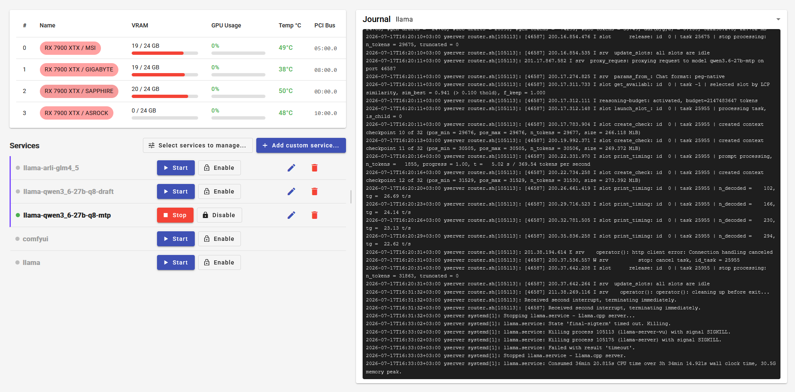
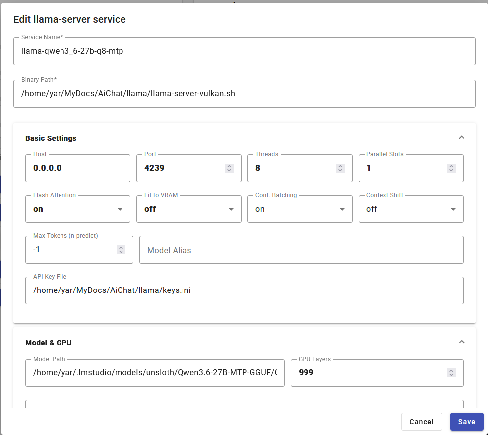
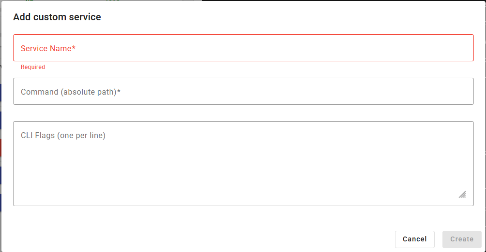

# AI Server Manager

Web dashboard for monitoring GPU server and managing AI services (llama.cpp, ComfyUI, and any other).





## Features

- **GPU Monitoring** — Real-time GPU utilization, temperature, and VRAM usage. Supports NVIDIA, AMD, and Intel GPUs with automatic detection and deduplication.
- **Custom Services** — Create your own service with a custom name, command, and CLI flags. Installed as `systemd` unit.
- **Managed Services** — Discover and manage any installed systemd service from the dashboard. Start, stop, enable, or disable with a single click.
- **Cross-platform** — Runs on Linux (systemctl) and Windows (Windows Services, experimental).

## Architecture

Monorepo with two packages:

| Package      | Stack                                       |
| ------------ | ------------------------------------------- |
| **backend**  | Node.js, Express 5, TypeScript, InversifyJS |
| **frontend** | Angular 22, Angular Material, RxJS, signals |

## Prerequisites

- **Node.js** 24+
- **Linux**: `sudo apt install libpam0g-dev` (for PAM bindings)

## Quick Start

```bash
# Linux need PAM library
sudo apt install libpam0g-dev

# Run from npm without cloning the repo
npx --yes aiservermanager@latest

# ...or run from the source checkout
# Install dependencies for all packages
npm run install:all

# Run in development mode (backend + frontend)
npm run dev

# Build for production
npm run build

# Start production server
npm start
```

The server listens on `PORT=4243` and `HOST=127.0.0.1` by default.
Override with environment variables (HOST and PORT).

## GPU Detection Pipeline

**Bootstrap** (runs once):

1. **Detectors** — `nvidia-smi`, `rocm-smi`, WMI (Windows), registry lookups
2. **Deduplication** — by `vendor:pciBusId` (fallback: `vendor:name`), highest-score entry wins
3. **Enrichers** — `lspci` branding, `vulkaninfo` details
4. **Engine naming** — assigns `cuda0`, `rocm0`, `vulkan0` for llama.cpp

**Polling** (every request):

- Usage probes collect dynamic metrics (utilization %, temperature, VRAM used) and merge them with the cached static info by `pciBusId`.

## Release

Published to npm as **`aiservermanager`**. End users run it without cloning or installing:

```bash
npx --yes aiservermanager@latest
```

The release flow is fully automated by the `publish` job in `.github/workflows/publish.yml` (build → test → package → `npm publish`). To release a new version:

1. Bump the version in the root `package.json` (must match the tag), e.g. `0.1.0` → `0.1.1` for a patch.
2. Commit and push:
   ```bash
   git add package.json && git commit -m "v0.1.1" && git push
   ```
3. Tag and push the tag — this triggers the publish:
   ```bash
   git tag v0.1.1
   git push origin v0.1.1
   ```
4. Verify:
   ```bash
   npm view aiservermanager
   ```

**One-time setup**: a GitHub environment named **NPM** with the secret `NPM_TOKEN` (npm access token with publish permission).

## License

MIT — see [LICENSE](LICENSE)
